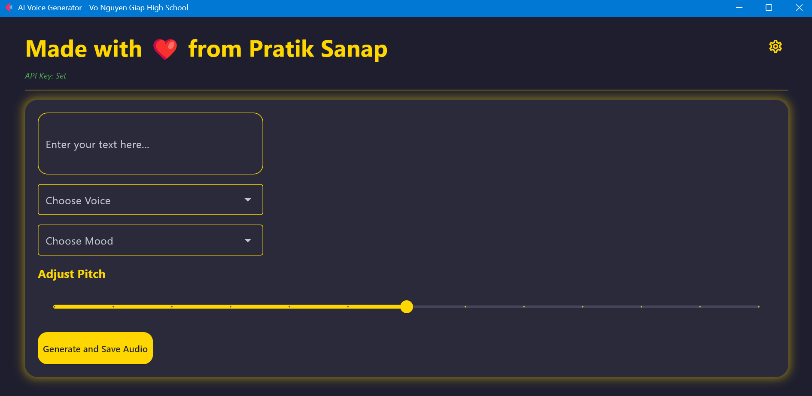

# AI Voice Generator (Flet & Murf.ai)

Made with ❤️ by Pratik Sanap

A simple desktop application built with Python and Flet to generate AI voice from text using the Murf.ai API.



## Demo Video


## Features

- Multi-line text input for text-to-speech conversion  
- Select voices from a dynamically updated list of available **US English (en-US)** and **UK English (en-UK)** voices from Murf.ai  
- Choose appropriate moods/styles for the selected voice  
- Adjust the pitch of the generated speech  
- Generate and save the audio file (MP3) to a user-selected location  
- Update the Murf.ai **API Key** through a dedicated settings dialog  
- Automatically persists the API Key in an `api_key.py` file for subsequent runs  
- Displays the current API Key status (set or not set)  
- User-friendly interface built with Flet  

## Prerequisites

- **Python 3.11+**  
- **pip** (Python package installer)  
- A **Murf.ai** account and a valid **API Key**  
  (You can obtain your API Key from your Murf.ai account dashboard)

## Installation

1. **Clone the Repository:**

    ```bash
    git clone https://github.com/your-username/AIVoice-MurfAI
    cd AIVoice-MurfAI
    ```

2. **Create and Activate a Virtual Environment (Recommended):**

    **Windows:**
    ```bash
    python -m venv venv
    .\venv\Scripts\activate
    ```

    **macOS/Linux:**
    ```bash
    python3 -m venv venv
    source venv/bin/activate
    ```

3. **Install Dependencies:**

    ```bash
    pip install -r requirements.txt
    ```

4. **Configure API Key:**

    Add the following line to `api_key.py`, replacing `"YOUR_MURFAI_API_KEY"` with your actual key:

    ```python
    API_KEY = "YOUR_MURFAI_API_KEY"
    ```

---

Let me know if you want me to add a usage section, licensing, or contribution guidelines too!
